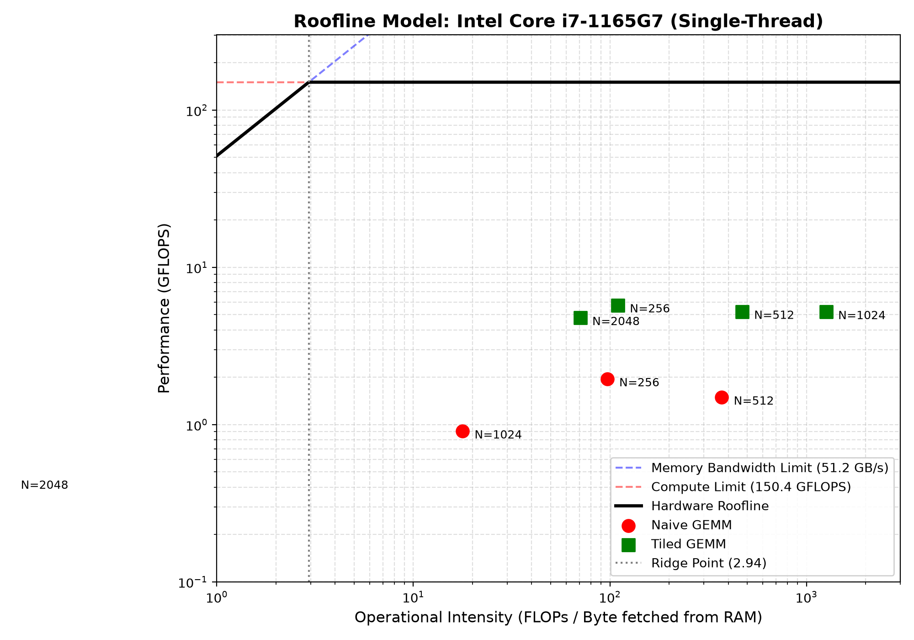

# Tensor Engine

A C++ tensor library with cache-blocked GEMM, numerically stable softmax, and O(1) transpose via stride manipulation.

---

## What This Repo Contains

- `Tensor` class: N-dimensional array with stride-based indexing, 32-byte aligned allocation, and `std::shared_ptr<float[]>` reference counting.
- `matmul_naive`: Triple-loop GEMM with stride-aware indexing. Baseline for benchmarking.
- `matmul_tiled`: Cache-blocked GEMM with 6 loops (outer 3 for tiles, inner 3 for multiply). TILE size chosen to fit in L1 cache. Uses `i,k,j` inner loop order with pointer arithmetic for contiguous access.
- `matmul`: Stride-aware GEMM with dynamic branching. Fast path uses contiguous pointer arithmetic when `Bstride1 == 1 && Cstride1 == 1` (compiler auto-vectorization). Fallback uses stride-aware indexing for transposed or strided tensors.
- `softmax` / `softmax_naive`: Numerically stable vs unstable softmax. Naive overflows on large inputs; stable version subtracts the max before exponentiation.
- `transpose()`: O(1) operation that reverses `shape` and `strideVector`. No data copied; both tensors share the same underlying buffer via `shared_ptr`.
- Rule of Five: Copy constructor/assignment perform deep copy. Move constructor/assignment transfer ownership and zero out the source.

---

## Build and Run

```bash
cmake -B build -DCMAKE_BUILD_TYPE=Release
cmake --build build
./build/tensor_run
```

### Build Profiles

| Profile | Flags | Use Case |
|---------|-------|----------|
| `Release` | `-O3 -march=native -ffast-math` | Production / max speed |
| `Debug` | `-O0 -g` | Valgrind-compatible, no arch-specific instructions |
| `Benchmark` | `-O2 -g` | Realistic baseline, no auto-vectorization tricks |
| `Asan` | `-O1 -g -fsanitize=address` | Memory error detection |

### Memory Safety Check

```bash
cmake -B build_dbg -DCMAKE_BUILD_TYPE=Debug
cmake --build build_dbg
valgrind --leak-check=full --show-leak-kinds=all ./build_dbg/tensor_run
```

```bash
==197371== HEAP SUMMARY:
==197371==     in use at exit: 0 bytes in 0 blocks
==197371==   total heap usage: 131,092 allocs, 131,092 frees, 1,908,928 bytes allocated
==197371== 
==197371== All heap blocks were freed -- no leaks are possible
==197371== 
==197371== For lists of detected and suppressed errors, rerun with: -s
==197371== ERROR SUMMARY: 0 errors from 0 contexts (suppressed: 0 from 0)
```
---

## Benchmarks

### GEMM: Naive vs Tiled

Profiled with `perf stat` on an Intel Core i7-1165G7 (single-thread). Tile size = 32.

| N | Implementation | Time (ms) | GFLOPS | LLC Misses |
|---|---------------|-----------|--------|------------|
| 256 | naive | 17.19 | 1.95 | 5,251 |
| 512 | naive | 190.65 | 1.41 | 19,384 |
| 1024 | naive | 2358.63 | 0.91 | 2,316,827 |
| 2048 | naive | 31631.8 | 0.54 | 1,383,486,785 |
| 256 | tiled | 6.00 | 5.59 | 4,134 |
| 512 | tiled | 57.27 | 4.69 | 9,809 |
| 1024 | tiled | 442.34 | 4.85 | 36,543 |
| 2048 | tiled | 3649.98 | 4.71 | 3,175,178 |
### Roofline Model



*CPU: Intel Core i7-1165G7. Single-thread peak: 93.9 GFLOPS (measured: 2.93 GHz sustained clock under load × 32 FLOPs/cycle, AVX2 FMA). Memory bandwidth: 18.5 GB/s (measured RAM read bandwidth, not theoretical DDR4-3200 peak).*

### Methodology

The Roofline plot shows that by the LLC-miss proxy for memory traffic, most points fall to the right of the 5.08 ridge point, placing them in the compute-bound region by operational intensity. However, both naive and tiled perform far below the measured 93.9 GFLOPS compute roof due to missing SIMD intrinsics, no register blocking, and cache associativity conflicts within the tile. The 93.9 GFLOPS ceiling reflects sustained single-core clock speed under real load (~2.93 GHz, measured via /proc/cpuinfo sampling during a 30+ second matmul run), not the CPU's 4.7 GHz turbo spec, which the core does not sustain under continuous compute.
### Known Limitations

The tiled kernel reaches ~5 GFLOPS, which is about 5% of the measured single-core peak (93.9 GFLOPS).
## Implementation Notes

- **Flat Data Layout:** Memory is a single 1D `float*` array, 32-byte aligned via `std::aligned_alloc` (Linux) or `_aligned_malloc` (Windows), wrapped in `std::shared_ptr<float[]>` with a custom deleter.
- **Stride Vector:** Computed at construction for row-major layout. `transpose()` reverses both `shape` and `strideVector`, making arbitrary-dimension transpose a metadata-only operation.
- **Bounds Checking:** `operator()` validates coordinate rank and bounds, throwing `std::out_of_range` on violation.
- **SIMD Fast Lane:** `matmul` checks if the inner dimension is contiguous (`Bstride1 == 1`). If true, it uses raw pointer arithmetic (`B_row[j]`, `C_row[j]`) that the compiler can auto-vectorize with AVX2. If false, it falls back to stride-aware indexing.
- **Tiled GEMM:** Outer 3 loops step by TILE. Inner 3 loops use `i,k,j` order with `std::min` boundary handling. `A(i,k)` is hoisted to a register and reused across the inner `j` loop. Pointer arithmetic is used for B and C rows when contiguous.
- **Softmax Stability:** Computes the maximum value first, then subtracts it from every element before calling `std::exp()`. This keeps the largest exponent at `e^0 = 1`, preventing overflow on inputs like `[1000, 1001, 999]`.
- **Aligned Allocation:** `data_initialization` rounds up to the nearest 32-byte boundary and zero-initializes with `std::memset`.

---

## Tests

The test suite in `main.cpp` covers:

- **Allocation & Indexing:** Basic element access, bounds checking, rank mismatch.
- **Transpose:** Zero-copy aliasing, shape reversal, stride correctness.
- **Matmul:** All 4 stride combinations (normal×normal, normal×transposed, transposed×normal, transposed×transposed), identity check, outer product.
- **Softmax:** Numerical stability on extreme values, sum-to-one verification, uniform input handling.
- **Rule of Five:** Deep copy independence, move ownership transfer.
- **Tiled GEMM Correctness:** Square (N=256, TILE=64), non-divisible (N=100, TILE=32), small exact (N=4, TILE=2).
- **Benchmark:** 500×500 timing across all stride cases, correctness verification on small exact integer matrices.
